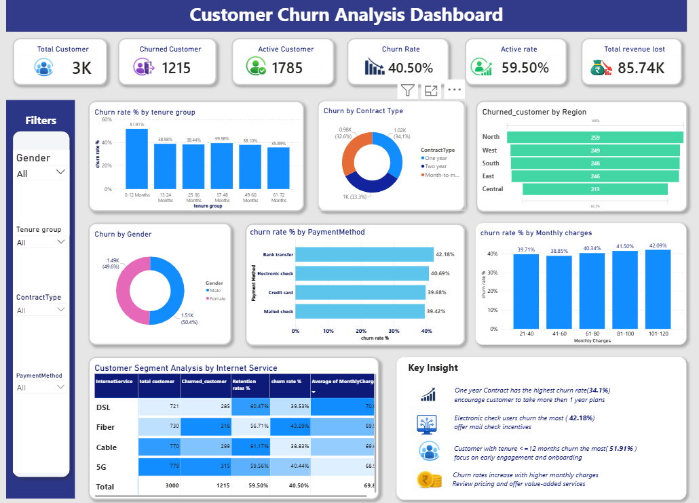

# customer-churn-analysis-dashboard
Interactive Power BI dashboard analyzing customer churn patterns, retention trends, customer demographics, and key factors influencing customer attrition to support data-driven decision-making.

## Project Overview

This Customer Churn Analysis Dashboard was developed to analyze customer behavior, identify churn patterns, and understand the key factors influencing customer retention. The dashboard provides valuable insights into customer demographics, service usage, and churn trends, enabling businesses to make data-driven decisions to improve customer retention and reduce churn.

## Tools Used

* Power BI
* Microsoft Excel
* Power Query
* DAX

## Key Metrics

* Total Customers
* Churned Customers
* Active Customers
* Churn Rate
* Active rate 
* Total Revenue lost  

## Dashboard Features

* Customer Churn Analysis
* Demographic Insights
* Tenure Distribution Analysis
* Service Subscription Analysis
* Monthly Charges Analysis
* Contract Type Analysis
* Interactive Filters and Slicers

## Business Insights

* Identified customer segments with the highest churn risk.
* Analyzed the impact of contract types and service usage on customer retention.
* Evaluated customer tenure and monthly charges to understand churn behavior.
* Highlighted key factors contributing to customer attrition.
* Provided actionable recommendations to improve customer retention strategies.

## Project Outcome

The dashboard enables businesses to monitor churn trends, identify at-risk customers, and implement targeted retention strategies. By leveraging data-driven insights, organizations can improve customer satisfaction, reduce churn, and enhance long-term business growth.

## Files Included

* Customer_Churn_Dashboard.pbit
* Customer_Churn_Dataset.xlsx
* Dashboard_Screenshot.png

